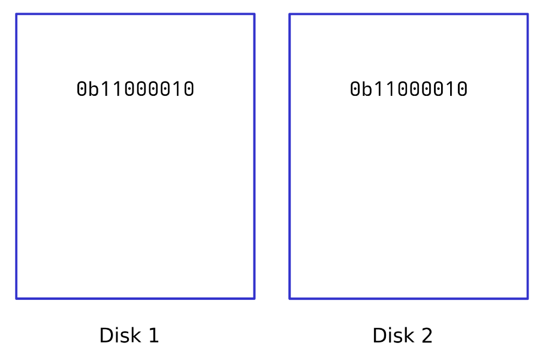
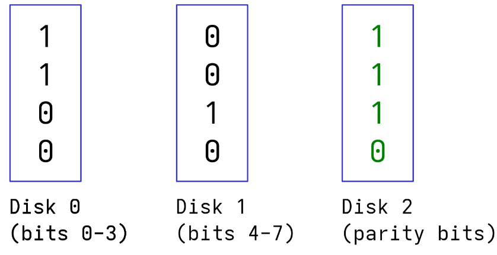
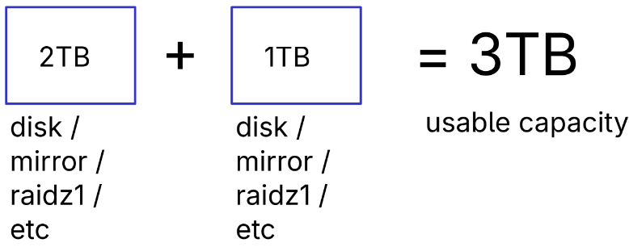

# The problem

- You have files that you don't want to lose 
- You have a disk to store the files (NVMe, Hard Drives, USB storage sticks, SD cards, etc)
- You want your files to be okay even if a program or person accidentally deletes or messes up the files
- You want your files to be okay even if the disk stops functioning
- You have so many files that they can't fit on a single disk
- You want a way to back up your files to a separate computer
- You want a way of checking that your files are still intact

---

# ZFS
- A file system (other examples of file systems include FAT, NTFS, ext4, btrfs)
- Lets you add up the storage from multiple disks to have more space to store files
- Lets you store the same files on multiple disks so that if one of them stops functioning, you can still access your files (redundancy)
- Never gives you corrupted files when reading (checksums)

---

# Mirrors

- All disks in a mirror store exactly the same data
- Mirrors have 2+ disks
- As long as one of the disks in the mirror is working and not corrupted, you can access your files
- Your usable capacity is the capacity of 1 disk
- Adding more disks to the mirror does not increase the total capacity

---

# Mirrors - Check your understanding
- If you have a mirror of 2 disks which can store 1TB each, what is the total capacity?
- If you have a mirror of 3 disks which can store 4TB each, what is the total capacity?
- If you have a 1TB disk and a 2TB disk, how much capacity can you use in a mirror configuration?

---

# `raidz1`

---

# `raidz1`
- Consists of 3+ disks of equal size
- 1 disk is used for parity
- The total amount of usable capacity is (the number of disks - 1) * (the capacity of a disk)
- If any 1 disk gets corrupted, your files are still intact
- This is possible using XOR
- If 1 disk gets corrupted and a 1 more gets corrupted before you can replace the first one, you lose your files

---

# `raidz1` - check your understanding
- In a `raidz1` composed of 3 disks that can each store 1TB, what is the total capacity?
- In a `raidz1` composed of 5 disks that can each store 8TB, what is the total capacity?
- Assuming you have 3+ disks, what has more redundancy, a mirror or `raidz1` configuration?
- Assuming you have 3+ disks, what has more total capacity, a mirror or `raidz1`?

---

# `raidz2`
- Similar to `raidz1`
- 2 parity disks
- Up to 2 disks can get corrupted and your files will still be intact

---
# `raidz2` - check your understanding
- What is the total capacity of a `raidz2` composed of 6 drives that each store 20TB?
- How do `mirror`, `raidz1`, and `raidz2` compare to each other? What are the strengths, weaknesses, and trade-offs?
- In what scenarios would you use `raidz2` rather than `raidz1`?

---
# `raidz3`
It's what you would think it is.

---
# Summing Capacities (`vdev`s)

- Each group of disks is called a `vdev`
- You can combine multiple `vdev`s to combine their capacity
- Useful for simply combining the capacities of multiple disks without any redundancy

---
# `vdev` states
| State       | Description |
| ----------- | ----------- |
| ONLINE      | All disks are working |
| DEGRADED    | One or more disks is not working, but the `vdev` is still functional because of redundancy |
| FAULTED     | The `vdev` is not functional |

- If a single `vdev` in a group of `vdev`s gets `FAULTED`, you cannot access your files.

---
# `zpool`s
- A `zpool` consists of multiple `vdev`s
- It has a name set by the user and a random numeric id

---
# Datasets
- A file system backed by a `zpool`
- Has its own mount point, settings, and permissions
- A `zpool` can have multiple datasets
- The smallest unit of backup-able data
- If you have a lot of files, it's recommended to organize them into multiple datasets so that it's easier to move them around different `zpool`s
- A dataset is identified by `<zpool>/<dataset>`. So a an example dataset would be `my-zpool/my-dataset`.

---
# Snapshots

- Let you create a restore point in a dataset
- Taking snapshots is pretty fast and doesn't block other file system operations
- You can rollback to a snapshot to go back to how all the files in the dataset were at the time when the snapshot was taken
- Linear, no branches like Git
- Identified as `<zpool>/<dataset>@<snapshot>`

---
# Backing up snapshots
- `zfs send` and `zfs receive`
- Encrypted
- Incremental
- Two-machine backup system
- `zfs send` to file

---
# Scrubbing
- `zpool scrub`
- Reads all of your files and makes sure they are not corrupted
- Checksums
- Repairs corrupted files if possible

---
# Maintenance Commands
- Often used when disks need to be physically attached and detached 
- `zpool replace`
- `zpool offline`
- `zpool offline`

---
# Resilvering
- Initializes / updates a disk
- Automatically starts `zpool replace` and `zpool online`

---
# Installing ZFS
- Install OpenZFS
- Officially supports Linux and FreeBSD
- Kernel module (due to licensing)
- Super easy to install on Ubuntu and NixOS

---
# Getting started
- [OpenZFS Documentation](https://openzfs.github.io/openzfs-docs/index.html)
- [Arch Wiki](https://wiki.archlinux.org/title/ZFS)
- [Ubuntu ZFS Tutorials](https://ubuntu.com/tutorials?q=zfs)
- [NixOS Wiki](https://wiki.nixos.org/wiki/ZFS)
- [2.5 Admins Episode 256: Why ZFS](https://2.5admins.com/2-5-admins-256/)

